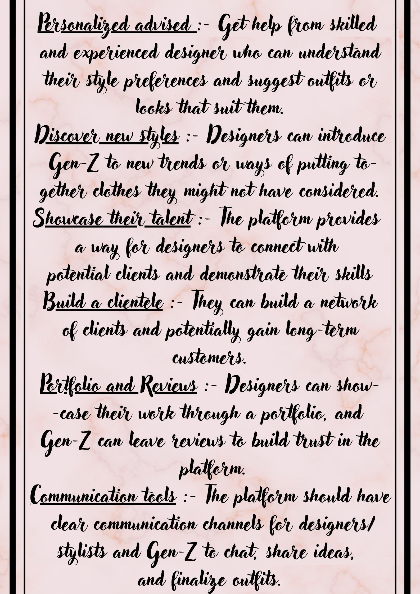

# Style_Synergy
"A platform connecting skilled fashion designers/stylists with Gen-Z individuals seeking trendy and personalized styling solutions."
# Style_Synergy_HTML code for main page 
<!DOCTYPE html>
<html lang="en">
<head>
    <meta charset="UTF-8">
    <meta name="viewport" content="width=device-width, initial-scale=1.0">
    <title>Style Synergy</title>
    <link rel="stylesheet" href="style.css">
    <link href="https://fonts.googleapis.com/css2?family=Pacifico&display=swap" rel="stylesheet">
</head>
<body>
    <header>
        
Style Synergy

        <nav>
            <ul>
                <li><a href="#home">Home</a></li>
                <li><a href="#about">About Us</a></li>
                <li><a href="#services">Services</a></li>
                <li><a href="#marketplace">Marketplace</a></li>
                <li><a href="#contact">Contact Us</a></li>
                <li><a href="file:///C:/Users/shivani%20patwa/Downloads/web%20development/Quiz1/login_registration/index1.html" class="login-button">Login</a></li>
            </ul>
        </nav>
    </header>

    <section id="home">
        

            <h2>Welcome to Style Synergy</h2>
            <h3>What is Style Synergy?</h3>
            
"Your go-to platform for the latest fashion trends. 
                Style Synergy is a interface designed to bring two individuals in need: Skilled fashion designer/stylist and the Gen-Z generation, who often struggle to style themselves according to current trends."
               
        

        

            <h2>How It Works</h2>
            
Get started in simple steps...

            
        

    </section>

    <section id="about">
        <h2>About Us</h2>
        
Our mission is to connect Gen-Z with skilled fashion designers.

        

            <h3>Meet the Team</h3>
            
Introduction to our team.

            
Shivani Patwa

            
Meenu Singh

        

    </section>

    <section id="services">
        <h2>Our Services</h2>
        
        

            <h3>Designers Connections</h3>
            
Skilled designers to help you with style preferences.

        

        

            <h3>Client Engagement</h3>
            
Platform for designers to connect with potential clients.

            
        

    </section>

    <section id="marketplace">
        <h2>Marketplace</h2>
        

            <h3>Products</h3>
            
Brands and products available in our store.

            
        

        

            <h3>Designers Portfolios</h3>
            
Showcase of designers' work.

            
        

        

            <h2>How was your experience?</h2>
            <h3>Customer Reviews:</h3>
            
Feedback from our users.

        

    </section>

    <section id="contact">
        <h2>Contact Us</h2>
        <form action="">
            

            <h1>Query Box</h1>
            

                <input type="text" placeholder="Your Name" required>
                <i class='bx bxs-user'></i>
            

            

                <input type="email" placeholder="Your Email" required>
                <i class='bx bxs-lock-alt'></i>
            

            

                <input type="text" placeholder="Your Query" required>
                <i class='bx bxs-lock-alt'></i>
            

            <button type="submit" class="btn">Submit</button>
            

        

        </form>

        

            <h3>Follow Us</h3>
            
Links to our social media channels.

            
        

    </section>

    <footer>
        
&copy; 2024 Style Synergy. All rights reserved.

    </footer>
</body>
</html>

# Style_Synergy_CSS code for main page 
body {
    font-family: 'Open Sans', sans-serif;
    margin: 0;
    padding: 0;
    background-color: #FFE6E6;
    color: #100f0f;
    background-image: url('download\ \(2\).png');
    background-size: cover; 
    background-position: center; 
    background-attachment: fixed; 
    text-align: center; 
}

header {
    background-color: rgba(255, 20, 147, 0.5); 
    color: #0c0c0c;
    padding: 20px 0;
    text-align: center;
    font-family: 'Lobster', cursive;
}

.logo {
    font-size: 48px; 
    font-weight: bold;
    font-family: 'Pacifico', cursive; 
    text-shadow: 2px 2px 5px rgba(0, 0, 0, 0.3); 
}

nav ul {
    list-style-type: none;
    padding: 0;
}

nav ul li {
    display: inline;
    margin: 0 15px;
}

nav ul li a {
    color: #FFE6E6;
    text-decoration: none;
    font-weight: bold;
    font-size: 20px; 
}

section {
    padding: 20px;
    margin: 10px 0;
    font-family: 'Open Sans', sans-serif;
    background: rgba(255, 230, 230, 0.5); 
    border-radius: 5px;
    font-size: 20px; 
}

#welcome, .how-it-works {
    background: rgba(255, 182, 193, 0.5); 
    padding: 20px;
    border-radius: 5px;
}

h2 {
    color: #0e0d0d;
    font-family: 'Lobster', cursive;
    font-size: 36px; 
}

button {
    background-color: rgba(255, 20, 147, 0.5); 
    color: #FFE6E6;
    padding: 10px 20px;
    border: none;
    border-radius: 5px;
    cursor: pointer;
    font-size: 20px; 
}

button:hover {
    background-color: rgba(255, 105, 180, 0.5); 
}

footer {
    background-color: rgba(255, 20, 147, 0.5); 
    color: #FFE6E6;
    text-align: center;
    padding: 10px 0;
    position: -ms-page;
    width: 100%;
    bottom: 0;
    font-size: 20px; 
}

form input, form textarea {
    width: 100%;
    padding: 10px;
    margin: 10px 0;
    border: 1px solid rgba(255, 20, 147, 0.5); 
    border-radius: 5px;
    background: rgba(255, 230, 230, 0.5); 
    font-size: 18px; 
}

form textarea {
    height: 100px;
}

form button {
    display: block;
    width: 100%;
    font-size: 20px; 
}

img {
    width: 25%; 
    height: auto;
    border-radius: 5px;
    margin-top: 20px;
}

# Style_Synergy JS code for main page

const express = require('express');
const mongoose = require('mongoose');
const bcrypt = require('bcryptjs');
const jwt = require('jsonwebtoken');
const multer = require('multer');
const bodyParser = require('body-parser');

const app = express();

app.use(bodyParser.json());
app.use(bodyParser.urlencoded({ extended: true }));

mongoose.connect('mongodb://localhost:27017/stylist-platform', { useNewUrlParser: true, useUnifiedTopology: true });

// Models
const User = require('./models/User');
const Post = require('./models/Post');

// User registration
app.post('/register', async (req, res) => {
    const { username, email, password } = req.body;
    const hashedPassword = await bcrypt.hash(password, 10);
    const user = new User({ username, email, password: hashedPassword });
    await user.save();
    res.status(201).send('User registered');
});

// User login
app.post('/login', async (req, res) => {
    const { username, password } = req.body;
    const user = await User.findOne({ username });
    if (!user) return res.status(400).send('User not found');

    const isMatch = await bcrypt.compare(password, user.password);
    if (!isMatch) return res.status(400).send('Invalid password');

    const token = jwt.sign({ id: user._id }, 'secret');
    res.json({ token });
});

// Middleware to authenticate user
const auth = (req, res, next) => {
    const token = req.header('Authorization');
    if (!token) return res.status(401).send('Access denied');

    try {
        const verified = jwt.verify(token, 'secret');
        req.user = verified;
        next();
    } catch (err) {
        res.status(400).send('Invalid token');
    }
};

// Create a post
const storage = multer.diskStorage({
    destination: (req, file, cb) => {
        cb(null, 'uploads/');
    },
    filename: (req, file, cb) => {
        cb(null, Date.now() + '-' + file.originalname);
    }
});
const upload = multer({ storage });

app.post('/post', auth, upload.single('image'), async (req, res) => {
    const { caption } = req.body;
    const post = new Post({ caption, image: req.file.path, user: req.user.id });
    await post.save();
    res.status(201).send('Post created');
});

// Like a post
app.post('/like/:id', auth, async (req, res) => {
    const post = await Post.findById(req.params.id);
    if (!post.likes.includes(req.user.id)) {
        post.likes.push(req.user.id);
        await post.save();
        res.status(200).send('Post liked');
    } else {
        res.status(400).send('Already liked');
    }
});

// Send connection request
app.post('/connect/:id', auth, async (req, res) => {
    const user = await User.findById(req.params.id);
    if (!user.requests.includes(req.user.id)) {
        user.requests.push(req.user.id);
        await user.save();
        res.status(200).send('Connection request sent');
    } else {
        res.status(400).send('Request already sent');
    }
});

app.use(express.static('public'));

app.listen(3000, () => {
    console.log('Server running on http://localhost:3000');
});

# Style_Synergy_HTML code for login page 

# When the user will click on the login icon it will take you to the login and registration page   

<!DOCTYPE html>
<html lang="en">
<head>
    <meta charset="UTF-8">
    <meta http-equiv="X-UA-Compatible" content="IE=edge">
    <meta name="viewport" content="width=device-width, initial-scale=1.0">
    <title>Login Form in HTML and CSS </title>
    <link rel="stylesheet" href="style.css">
    <link href='https://unpkg.com/boxicons@2.1.4/css/boxicons.min.css' rel='stylesheet'>
</head>
<body>
    

        <form action="">
            <h1>Login</h1>
            

                <input type="text" placeholder="Username" required>
                <i class='bx bxs-user'></i>
            

            

                <input type="password" placeholder="Password" required>
                <i class='bx bxs-lock-alt'></i>
            

            

                <label><input type="checkbox"> Remember me </label>
                <a href="#">Forgot password?</a>
            

            <button type="submit" class="btn">Login</button>
            

                
Don't have an account? <a href="#" id="register-link">Register</a>

            

        </form>
    

    

        <form action="">
            <h1>Register</h1>
            

                <input type="text" placeholder="Name" required>
                <i class='bx bxs-user'></i>
            

            

                <input type="text" placeholder="Phone Number" required>
                <i class='bx bxs-phone'></i>
            

            

                <input type="email" placeholder="Email" required>
                <i class='bx bxs-envelope'></i>
            

            

                <input type="password" placeholder="Password" required>
                <i class='bx bxs-lock-alt'></i>
            

            

                <input type="password" placeholder="Confirm Password" required>
                <i class='bx bxs-lock-alt'></i>
            

            

                <input type="number" placeholder="Age" required>
                <i class='bx bxs-cake'></i>
            

            <button type="submit" class="btn">Register</button>
            

                
Already have an account? <a href="#" id="login-link">Login</a>

            

        </form>
    

    
</body>
</html>

# Style_Synergy_CSS code for login page
@import url("https://fonts.googleapis.com/css2?family=Poppins:wght@300;400;500;600;700;800;900&display=swap");

* {
    margin: 0;
    padding: 0;
    box-sizing: border-box;
    font-family: "Poppins", sans-serif;
}

body {
    display: flex;
    justify-content: center;
    align-items: center;
    min-height: 100vh;
    background: url('image0_0.jpg');
    background-size: cover;
    background-position: center;
}

.wrapper {
    width: 420px;
    background: transparent;
    border: 2px solid rgba(255, 255, 255, .2);
    backdrop-filter: blur(20px);
    box-shadow: 0 0 10px rgba(0, 0, 0, .2);
    color: #fff;
    border-radius: 10px;
    padding: 30px 40px;
}

.wrapper h1 {
    font-size: 36px;
    text-align: center;
}

.input-box {
    position: relative;
    width: 100%;
    height: 50px;
    margin: 30px 0;
}

.input-box input {
    width: 100%;
    height: 100%;
    background: transparent;
    border: none;
    outline: none;
    border: 2px solid rgba(255, 255, 255, .2);
    border-radius: 40px;
    font-size: 16px;
    color: #fff;
    padding: 0 20px;
}

.input-box input::placeholder {
    color: #fff;
}

.input-box i {
    position: absolute;
    right: 20px;
    top: 50%;
    transform: translateY(-50%);
    font-size: 20px;
}

.remember-forgot {
    display: flex;
    justify-content: space-between;
    font-size: 14.5px;
    margin: -15px 0 15px;
}

.remember-forgot label input {
    accent-color: #fff;
    margin-right: 3px;
}

.remember-forgot a {
    color: #fff;
    text-decoration: none;
}

.remember-forgot a:hover {
    text-decoration: underline;
}

.btn {
    width: 100%;
    height: 45px;
    background: #fff;
    border: none;
    outline: none;
    border-radius: 40px;
    box-shadow: 0 0 10px rgba(0, 0, 0, .1);
    cursor: pointer;
    font-size: 16px;
    color: #333;
    font-weight: 600;
}

.register-link {
    font-size: 14.5px;
    text-align: center;
    margin-top: 20px;
}

.register-link p a {
    color: #fff;
    text-decoration: none;
    font-weight: 600;
}

.register-link p a:hover {
    text-decoration: underline;
}

